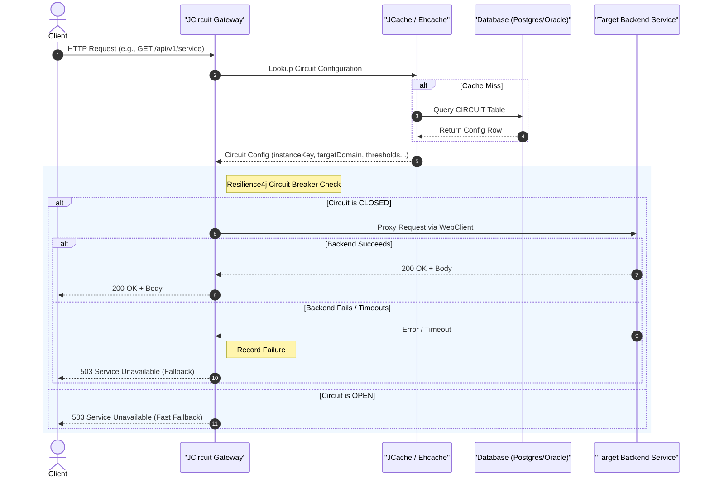

# JCircuit 🛡️

[](https://opensource.org/licenses/MIT)
[](https://jdk.java.net/25/)
[](https://spring.io/projects/spring-boot)

**JCircuit** is a high-performance, reactive proxy service designed to protect downstream services using the **Circuit Breaker** pattern. Built on **Spring WebFlux** and **Resilience4j**, JCircuit loads and configures circuit breakers dynamically from a database (**PostgreSQL** or **Oracle**). It leverages **Ehcache (JCache)** for second-level caching of circuit configurations, ensuring that database lookups do not become a bottleneck on high-throughput paths.

---

## 🚀 Key Features

* **Reactive & Non-Blocking**: Built on Spring WebFlux and Reactor Netty for optimal resource utilization and high concurrency.
* **Dynamic Circuit Breakers**: Register and configure circuit breakers at runtime by writing configuration records directly to your database.
* **Database Support**: Fully compatible with **PostgreSQL** and **Oracle Database**.
* **High Performance Caching**: Uses JCache/Ehcache to cache circuit breaker configurations, minimizing database roundtrips.
* **Distributed Tracing**: Out-of-the-box observability with Micrometer Tracing (Brave) for easy request correlation.

---

## 📐 Architecture & Request Flow

JCircuit acts as an intermediary proxy. When a request is received:

1. It matches the path or host against the cached `CIRCUIT` configurations.
2. It obtains or creates the corresponding Resilience4j `ReactiveCircuitBreaker`.
3. It proxies the request to the target backend using Spring's reactive `WebClient`.
4. If the call fails or the circuit is open, a fallback response (`503 Service Unavailable`) is returned immediately.



---

## 🛠️ Tech Stack

* **Language**: Java 25
* **Framework**: Spring Boot 4.1.0 (Reactive WebFlux)
* **Resilience Library**: Spring Cloud Circuit Breaker (Resilience4j Reactor)
* **Database & JPA**: Spring Data JPA / Hibernate 7.4.2
* **Caching**: Ehcache 3.12.0 (JSR-107 JCache provider)
* **HTTP Client**: Reactor Netty (`WebClient`)
* **Build Tool**: Gradle (Kotlin DSL)

---

## 🗄️ Database Schema

JCircuit reads its configurations from the `CIRCUIT` table. Below are the DDL scripts to create the table and seed sample data.

### 🐘 PostgreSQL DDL

```sql
CREATE TABLE circuit (
    instance_key VARCHAR(255) PRIMARY KEY,
    target_path VARCHAR(255) NOT NULL,
    target_domain VARCHAR(255) NOT NULL,
    sliding_window_type VARCHAR(50) NOT NULL DEFAULT 'COUNT_BASED',
    sliding_window_size INT NOT NULL DEFAULT 100,
    minimum_number_of_calls INT NOT NULL DEFAULT 100,
    failure_rate_threshold REAL NOT NULL DEFAULT 50.0,
    slow_call_rate_threshold REAL NOT NULL DEFAULT 100.0,
    slow_call_duration_threshold_ms BIGINT NOT NULL DEFAULT 60000,
    wait_duration_in_open_state_ms BIGINT NOT NULL DEFAULT 60000,
    permitted_calls_in_half_open INT NOT NULL DEFAULT 10,
    max_wait_duration_in_half_open_ms BIGINT NOT NULL DEFAULT 0,
    auto_transition_to_half_open BOOLEAN NOT NULL DEFAULT FALSE
);
```

### 🔴 Oracle Database DDL

```sql
CREATE TABLE circuit (
    instance_key VARCHAR2(255) PRIMARY KEY,
    target_path VARCHAR2(255) UNIQUE NOT NULL,
    target_domain VARCHAR2(255),
    sliding_window_type VARCHAR2(50) DEFAULT 'COUNT_BASED' NOT NULL,
    sliding_window_size NUMBER(10) DEFAULT 100 NOT NULL,
    minimum_number_of_calls NUMBER(10) DEFAULT 100 NOT NULL,
    failure_rate_threshold NUMBER(5, 2) DEFAULT 50.0 NOT NULL,
    slow_call_rate_threshold NUMBER(5, 2) DEFAULT 100.0 NOT NULL,
    slow_call_duration_threshold_ms NUMBER(19) DEFAULT 60000 NOT NULL,
    wait_duration_in_open_state_ms NUMBER(19) DEFAULT 60000 NOT NULL,
    permitted_calls_in_half_open NUMBER(10) DEFAULT 10 NOT NULL,
    max_wait_duration_in_half_open_ms NUMBER(19) DEFAULT 0 NOT NULL,
    auto_transition_to_half_open NUMBER(1) DEFAULT 0 NOT NULL
);

COMMIT;
```

---

## ⚙️ Configuration

Configure your database connection in [src/main/resources/application.yaml](./src/main/resources/application.yaml).

### PostgreSQL Profile

```yaml
spring:
  datasource:
    url: jdbc:postgresql://localhost:5432/jcircuit
    username: postgres
    password: yourpassword
  jpa:
    database-platform: org.hibernate.dialect.PostgreSQLDialect
    hibernate:
      ddl-auto: update
```

### Oracle Profile

```yaml
spring:
  datasource:
    url: jdbc:oracle:thin:@//localhost:1521/FREEPDB1
    username: system
    password: yourpassword
  jpa:
    database-platform: org.hibernate.dialect.OracleDialect
    hibernate:
      ddl-auto: update
```

---

## 🏃 Getting Started

### Prerequisites

* Java Development Kit (JDK) 25 or higher.
* An active PostgreSQL or Oracle instance.

### Build and Run

1. Clone the repository:

   ```bash
   git clone https://github.com/sajiwoo/jcircuit.git
   cd jcircuit
   ```

2. Build the project using Gradle:

   ```bash
   ./gradlew build -x test
   ```

3. Run the application:

   ```bash
   ./gradlew bootRun
   ```

The application starts on port `8080` by default.

### Containerize

1. Clone the repository:

   ```bash
   git clone https://github.com/sajiwoo/jcircuit.git
   cd jcircuit
   ```

2. Build the project using Gradle:

   ```bash
   ./gradlew build -x test
   ```

3. Build container image with Docker

  ```bash
    docker build -t jcircuit:latest .
  ```

  JCircuit is listen on port `8080`, you could bind the host port into container port (e.g "8080:8080")

---

## 🔌 API Usage

### Liveness Probe

You can verify the gateway status by hitting the `/ping` endpoint:

```bash
curl http://localhost:8080/ping
# Response: "pong"
```

### Proxying Requests

For any other request, the gateway will match the incoming path (e.g. `/api/external`) against the database-configured routes.

If `target_domain` is not configured in the database, you can specify it dynamically via the `X-Target-Domain` header:

```bash
curl -X GET http://localhost:8080/api/external \
     -H "X-Target-Domain: https://api.external-service.com"
```

If the target service experiences consecutive failures exceeding the `failure_rate_threshold`, the circuit breaker trips to `OPEN`. Subsequent requests will immediately receive a fallback response:

```json
{
  "status": 503,
  "error": "Service Unavailable",
  "message": "Service is temporary un-available"
}
```

---

## 📄 License

This project is open-source and licensed under the **MIT License**. See the [LICENSE](./LICENSE) file for more details.
